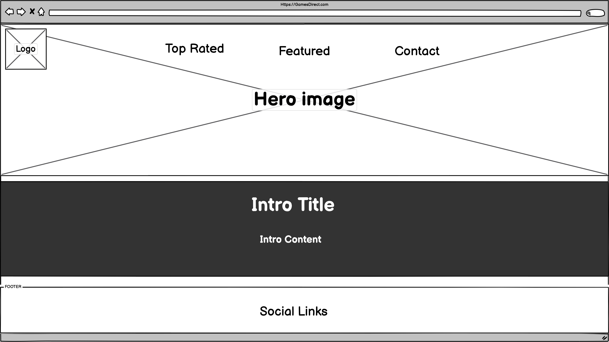

&nbsp;&nbsp;&nbsp;&nbsp;

---

## Table of Contents

## [**_UX/UI_**](#UX/UI)

#### - [User stories](#UX-Design)

#### - [Wireframes](#UX-Design)

---

<pre>GamesDirect was built with the intention of giving users easy to use access on the top rated games in 2020 and featured upcoming games of 2021.</pre>

---

# **UX/UI**

<ul>

# **_User Stories_**

### **_First Time Visitor Goals_**

<ul>
<li>As a First Time Desktop/Tablet/Mobile user, I want to be able to find content such as prices and dates on featured & top rated games so that I can purchase/pre-order a product</li>

<li>As a First Time Desktop/Tablet/Mobile user, I want to be introduced to the websites' main purpose/goal with ease, so that I can quickly decide if I'm interested in the service provided</li>

<li>As a First Time Desktop/Tablet/Mobile user, I want to have access and clearly see the companys' external social links (Twitter, Facebook, Instagram) so that I can view their activity timeline</li>

<li>As a First Desktop/Tablet/Mobile user, I want to be able to 'Sign Up' so that I am notified when any major updates and/or changes to the website or Company are made</li>
</ul>

---

### **_Returning Visitor Goals_**

 
<ul>

<li>As a Returning user, I want to feel up to date with any top rated/featured games this year/next year</li>

<li>As a Returning user, I want to be able to pre-order games that have been featured for next years' release</li>
<li>As a Returning user, I want to be able to contact/email support if I feel they have misssed out on a top rated/featured game</li></ul> 

---

### **_Frequent Visitor Goals_**

 
<ul><li>As a Frequent user, I want to be able to see if/when there has been any new additions added to the top rated games this year, so I can be informed about this product and make a purchase if I wish to</li>
<li>As a Frequent user, I want to be able to check if there have been any additional features added to the featured games section, so I can</li> </ul>
 

---

[comment]: <> (--------------------------------WIREFRAMES)

# HOME PAGES

[comment]: <> (--------------------------------HOME PAGES)

### **Mobile**
 

### **Tablet**

### **Desktop**

 
 

---

[comment]: <> (--------------------------------TOP RATED PAGES)

## **TOP RATED PAGES**

***

### **Mobile**
 

### **_Tablet_**

### **_Desktop_**

 
 

***
[comment]: <> (--------------------------------FEATURED PAGES)   
## **FEATURED PAGES**

***

### **Mobile**

### **Tablet**

### **_Desktop_**

---

[comment]: <> (--------------------------------CONTACT PAGES)

## **CONTACT PAGES**
***

### **_Mobile_**

### **_Tablet_**

### **_Desktop_**

### **_Wireframes [PDF]_**

[Home Page](assets/wireframes/pdf/Home.pdf) 
[Top Rated Page](assets/wireframes/pdf/Toprated.pdf) 
[Featured Page](assets/wireframes/pdf/Featured.pdf) 
[Contact Page](assets/wireframes/pdf/Contact.pdf)
