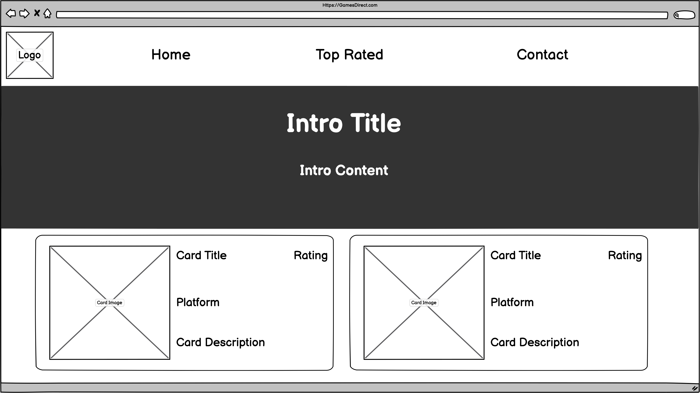
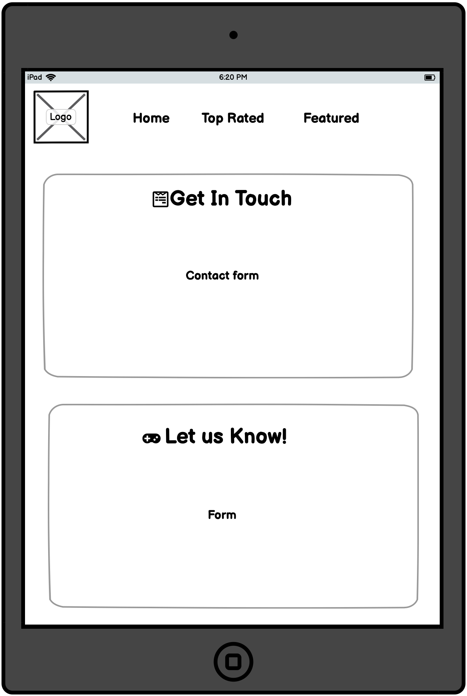

&nbsp;&nbsp;&nbsp;&nbsp;

---

## Table of Contents

## [UX/UI](#UX/UI)

## [User stories](#User_Stories)

### - [Wireframes](#Wireframes)

---

GamesDirect was built with the intention of giving users easy to use access on the top rated games in 2020 and featured upcoming games of 2021.

---

# **UX/UI**

<ul>

# **User Stories**

### **First Time Visitor Goals**

<ul>
<li>I should to be able to find content and navigate around the web application with ease</li>
<li>I should be able to view a detailed description on the web applications' main focus, to ensure it suites my needs</li>
<li>I should be able to view the highest rated games featured for the coming year</li>
<li>I should be able to easily contact the websites' support team regarding any enquiries/suggestions I have</li>
<li>I should be able to effectively view additions to the featured games  section clearly and efficiently</li>
<li>I should be able to view the web application and the content within it clearly on my mobile/tablet device</li>

</ul>

### **Frequent Visitor Goals**

<ul>
<li>I should be able to view the external social links effortlessly</li>
<li>I should be able to view and compare ratings & platforms on individual products</li>
<li>I should be able to view a detailed description on the web applications' main focus, to ensure it suites my needs</li>
<li>I should be able to see any recent updates/changes made to the web application</li></ul>

### **Returning Visitor Goals**

<ul>
<li>I should be able to view the web application and the content within it clearly on my mobile/tablet device</li>
<li>I should be up to date with any top rated/featured games this year/next year</li>
<li>I should be able to contact/email support if I feel they have misssed out on a top rated/featured game</li></ul> 

---

# Structure & Features

 

## **FIRST TIME VISITORS**

The Home page will contain a navigation bar to let the user easily navigate around the web application, The purpose of this is to support the user story: _<pre>I should be able to find content & navigate the web application with ease</pre>_

Each page will contain an introduction banner to display what the pages' description is, The purpose of this is to support the user story:

_<pre>I Should be able to view a detailed description on the web applications' main focus, to ensure it suites my needs</pre>_

The Featured page will contain all of next years' top rated games, The purpose of this is to support the user story:

_<pre>I should be able to view the highest rated games featured for the coming year</pre>_

The web application has a Contact page where the user can directly contact the support team, The purpose of this is to support the user story:

_<pre>I should be able to easily communicate with website support regarding any enquiries/suggestions I have</pre>_

Custom CSS will be applied to help the content follow a strict typography/font/color structure, The purpose of this is to support the user story:

_<pre>I should be able to effectively view additions to the featured games section clearly and efficiently</pre>_

Custom front-end frameworks such as Bootstrap will be used to help structure the content on each page with mobile/tablet & desktop support in mind to help with user readability and visibility, The purpose of this is to support the user story:

_<pre>I should be able to view the web application and the content within it clearly on my mobile/tablet device</pre>_

The web application will have a footer element on every web page that will offer external social links and other relative information, The purpose of this is to support the user story:

_<pre>I should be able to view the external social links effortlessly</pre>_

## **RETURNING VISITORS**

Custom CSS will be applied to help the content follow a strict typography/font/color structure, The purpose of this is to support the user story:

_<pre>I should be able to effectively view additions to the featured games section clearly and efficiently</pre>_

The web application has a Contact page where the user can directly contact the support team, The purpose of this is to support the user story:

_<pre>I should be able to easily communicate with website support regarding any enquiries/suggestions I have</pre>_

## **FREQUENT VISITORS**

The Featured & Top Rated pages will contain each products supported platform & product rating, The purpose of this is to support the user story:

_<pre>I should be able to view and compare ratings & platforms on individual products</pre>_

The web application will frequentely keep the competetive products up to date, The purpose of this is to support the user story:
_<pre>I should be able to see any recent updates/changes made to the web application</pre>_

---

# **FEATURES TO ADD**

<ul>
<li>Add a Sign up & Sign in function to offer user notifications on updates</li>
<li>Add a catergory to Top rated section to keep a more organized web application</li>
<li>Add a search function so users can easily locate specific queries</li>
<li>Add a compare function that allows users to compare products</li>
<li>Add a in browser activity log showing what update/products have been pushed to the web application</li>
</ul>

---

# **TECHNOLOGIES USED**
<ul><li>HTML</li>
<ul><li>This web application uses HTML (Hyper text markup langauge) as the main language to structure each web page</li>
</ul>
</ul>

<ul><li>CSS</li>
<ul><li>This web application uses CSS (Cascasing style sheet) to style each web page</li>
</ul>
</ul>
<ul><li>

[Font Awesome](https://fontawesome.com)</li>

<ul><li>This web application uses Font Awesome to take advantage of their icons</li>
</ul>
</ul>

<ul><li>

[Bootstrap](https://getbootstrap.com)</li>

<ul><li>This web application uses Bootstrap to adopt strong grid layouts</li>
</ul>
</ul>
<ul>
<li>

[Google Fonts](https://fonts.google.com)</li>

<ul><li>This web application uses Google Fonts to ensure the applications content is as readable as possible for the user</li>
</ul>
</ul>

<ul><li>

[Balsamiq](https://balsamiq.com/wireframes/)</li>

<ul><li>This documentations wireframe work was provided using Balsmaiqs' application tools</li>
</ul>
</ul>

<ul><li>

[Visual Studio Code](https://code.visualstudio.com/)</li>

<ul><li>Visual Studio Code was tbe Integrated Development Environment used to develope the web application</li>
</ul>
</ul>

<ul><li>

[GitHub](https://github.com/)</li>

<ul><li>GithHub is the hosting site used to store the source code for the web application</li>
</ul>
</ul>

<ul><li>

[Git](https://git-scm.com/)</li>

<ul><li>Git is used as a version control software to push code to the GitHub repository where the source code is located</li>
</ul>
</ul>

<ul><li>

[Chrome Developer Tools](https://developers.google.com/web/tools/chrome-devtools)</li>

<ul><li>Google chrome provides a built in developer tool that can be used to inspect web page elements that can help debug issues with the site layout and test different CSS styles</li>
</ul>
</ul>

<ul><li>

[Coolors](https://coolors.co)</li>

<ul><li>This web applications' color scheme was created by using Coolors' palette creator</li>
</ul>
</ul>

[comment]: <> (--------------------------------WIREFRAMES)

# **FRAMEWORKS**

## Home Pages

### **_Mobile/Tablet/Desktop_**

---

[comment]: <> (--------------------------------TOP RATED PAGES)

## **_TOP RATED PAGES_**

---

### **Mobile/Tablet/Desktop**

---

[comment]: <> (------5--------------------------FEATURED PAGES)

# **_FEATURED PAGES_**

### **Mobile/Tablet/Desktop**

[comment]: <> (--------------------------------CONTACT PAGES)

## **CONTACT PAGES**

---

### **Mobile/Tablet/Desktop**

[comment]: <> (--------------------------------HOME PAGESS)

### **_Wireframes [PDF]_**

[Home Page](assets/wireframes/pdf/Home.pdf) 
[Top Rated Page](assets/wireframes/pdf/Toprated.pdf) 
[Featured Page](assets/wireframes/pdf/Featured.pdf) 
[Contact Page](assets/wireframes/pdf/Contact.pdf)  

---
