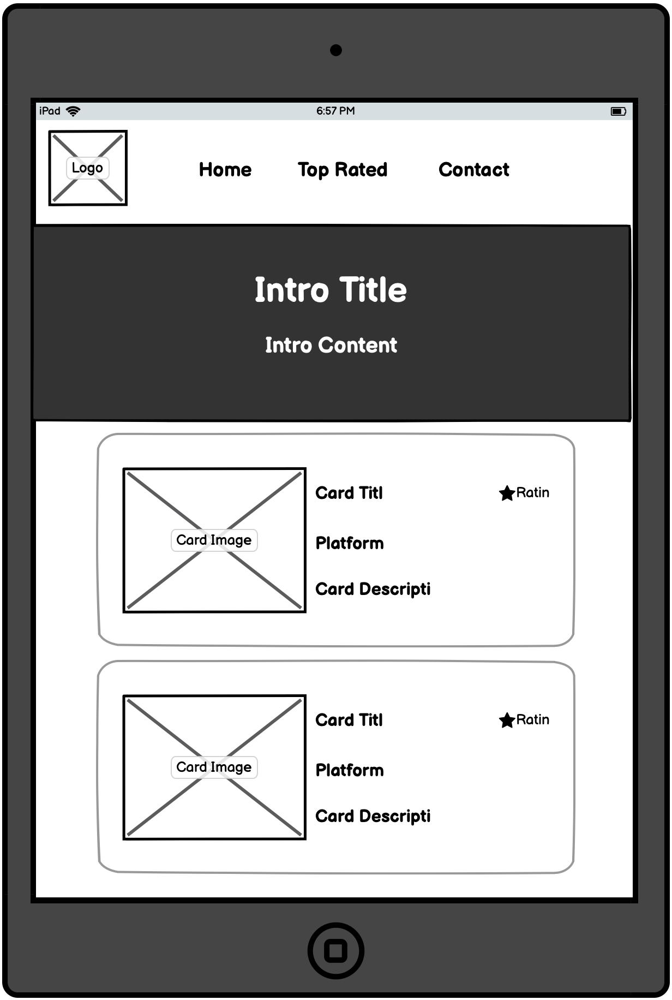

# GAMES DIRECT
&nbsp;&nbsp;&nbsp;&nbsp;

---
# Live website
The link to the live website can be found here: https://somadevv.github.io/GamesDirect/

## Table of Contents
* [Purpose](#Purpose)
* [User stories](#User-Stories)
    * [First Time Visitor Goals](#First-Time-Visitor-Goals)
    * [Returning Visitor Goals](#Returning-Visitor-Goals)
    * [Frequent User Goals](#Frequent-User-Goals)
* [User experience](#User-Experience)
    * [First Time Visitors](#First-Time-Visitors)
    * [Returning Visitors](#Returning-Visitors)
    * [Frequent Visitors](#Frequent-Visitors)
* [Structure](#STRUCTURE)
* [Design](#DESIGN)
    * [Colour Scheme](###Colour-Scheme)
    * [Typography](###Typography)
    * [Imagery](###Imagery)
* [Features](#FEATURES)
    * [Existing Features](##Existing-Features)
    * [Future Features](##Features-Left-to-Implement)
* [Technologies](#TECHNOLOGIES)
* [Testing](#TESTING)
* [Deployment](#DEPLOYMENT)
* [Credits](#CREDITS)
    * [Imagery](##Imagery)
    * [Code](##Code)
    * [Acknowledgements](##Acknowledgements)

# PURPOSE
GamesDirect was built with the intention of giving users an easy-to-use web application granting them access to our top-rated/featured games upcoming games of 2021.
This Website was created for the sole purpose of completing my first Milestone Project for the Code Institute's Full Stack Developer course. It was built using HTML, CSS, and Bootstrap. A full list of technologies used can be found in the technologies section of this document.

---

<ul>

# **User Stories**

### **First Time Visitor Goals**

<ul>
<li>I should be able to find content and navigate around the web application with ease</li>
<li>I should be able to view a detailed description of the web applications' main focus, to ensure it suits my needs</li>
<li>I should be able to view the highest rated games featured for the coming year</li>
<li>I should be able to easily contact the websites' support team regarding any enquiries/suggestions I have</li>
<li>I should be able to effectively view additions to the featured games  section clearly and efficiently</li>
<li>I should be able to view the web application and the content within it clearly on my mobile/tablet device</li>

</ul>

### **Frequent Visitor Goals**

<ul>
<li>I should be able to view the external social links effortlessly</li>
<li>I should be able to view and compare ratings & platforms on individual products</li>
<li>I should be able to view a detailed description on the web applications' main focus, to ensure it suites my needs</li>
<li>I should be able to see any recent updates/changes made to the web application</li></ul>

### **Returning Visitor Goals**

<ul>
<li>I should be able to view the web application and the content within it clearly on my mobile/tablet device</li>
<li>I should be up to date with any top rated/featured games this year/next year</li>
<li>I should be able to contact/email support if I feel they have missed out on a top rated/featured game</li></ul> 

# **USER EXPERIENCE**

## FIRST TIME VISITORS

The Home page will contain a navigation bar to let the user easily navigate around the web application, The purpose of this is to support the user story: _<pre>I should be able to find content & navigate the web application with ease</pre>_

Each page will contain an introduction banner to display what the pages' description is, The purpose of this is to support the user story:

_<pre>I Should be able to view a detailed description on the web applications' main focus, to ensure it suites my needs</pre>_

The Featured page will contain all of next years' top rated games, The purpose of this is to support the user story:

_<pre>I should be able to view the highest rated games featured for the coming year</pre>_

The web application has a Contact page where the user can directly contact the support team, The purpose of this is to support the user story:

_<pre>I should be able to easily communicate with website support regarding any enquiries/suggestions I have</pre>_

Custom CSS will be applied to help the content follow a strict typography/font/color structure, The purpose of this is to support the user story:

_<pre>I should be able to effectively view additions to the featured games section clearly and efficiently</pre>_

Custom front-end frameworks such as Bootstrap will be used to help structure the content on each page with mobile/tablet & desktop support in mind to help with user readability and visibility, The purpose of this is to support the user story:

_<pre>I should be able to view the web application and the content within it clearly on my mobile/tablet device</pre>_

The web application will have a footer element on every web page that will offer external social links and other relative information, The purpose of this is to support the user story:

_<pre>I should be able to view the external social links effortlessly</pre>_

## FREQUENT VISITORS

The Featured & Top Rated pages will contain each products supported platform & product rating, The purpose of this is to support the user story:

_<pre>I should be able to view and compare ratings & platforms on individual products</pre>_

The web application will frequently keep the competitive products up to date, The purpose of this is to support the user story:
_<pre>I should be able to see any recent updates/changes made to the web application</pre>_

## RETURNING VISITORS

Custom CSS will be applied to help the content follow a strict typography/font/color structure, The purpose of this is to support the user story:

_<pre>I should be able to effectively view additions to the featured games section clearly and efficiently</pre>_

The web application has a Contact page where the user can directly contact the support team, The purpose of this is to support the user story:

_<pre>I should be able to easily communicate with website support regarding any enquiries/suggestions I have</pre>_

---

---

# STRUCTURE

Custom CSS and/or Bootstrap will be used to make the Website responsive by the use of media queries and/or the Bootstrap Grid system.

All web pages will contain a Navigation menu at the top of the Webpage that directs them to their respected page to allow for easy navigation around the site. The Nav Menu will be collapsable on a Mobile device to make use of space on smaller devices. The purpose of this is to fulfill the user story:

<pre>I should be able to view the web application and the content within it clearly on my mobile/tablet device</pre>

All pages will be responsive and the layouts will change depending on screen size. This is to ensure content flow is appealing, images are displayed properly. The purpose of this is to fulfill the user story:

<pre>I should be able to view the web application and the content within it clearly on my mobile/tablet device</pre>

The Home Page will contain a small section explaining what the site's main focus is. The purpose of this is to fulfill the user story:

<pre>I Should be able to view a detailed description of the web applications' main focus, to ensure it suits my needs</pre>

The Contact Page will contain a form that can be used to contact the support team through the website. The purpose of this Page is to fulfill user stories:

<pre>I should be able to easily communicate with website support regarding any enquiries/suggestions I have</pre>

A footer has been added to all web pages across the website with social links included inside it. The purpose of this is to fulfill user stories:

<pre>I should be able to view the external social links effortlessly</pre>

The Top-Rated page contains multiple games with their respective ratings. The purpose of this is to fulfill user stories:

<pre>I should be able to view and compare ratings & platforms on individual products</pre>

 

# DESIGN
### Colour Scheme
The main background colour is a pinkish red #fe4066 for the house style
The main website text is black #000000

### Typography
The main headings/titles on all pages use the 'Poppins' font while the rest of the websites content uses the 'Source Code Pro' font

### Imagery
The website logo was taken from [Google](https://google.com)
All images used throughout the website were taken from a free source: [Wallpaperaccess](https://wallpaperaccess.com)

### Wire frames
[comment]: <> (--------------------------------WIREFRAMES)

## Home Pages

### **_Mobile/Tablet/Desktop_**

---

[comment]: <> (--------------------------------TOP RATED PAGES)

## **_TOP RATED PAGES_**

---

### **Mobile/Tablet/Desktop**

---

[comment]: <> (------5--------------------------FEATURED PAGES)

# **_FEATURED PAGES_**

### **Mobile/Tablet/Desktop**

[comment]: <> (--------------------------------CONTACT PAGES)

## **CONTACT PAGES**

---

### **Mobile/Tablet/Desktop**

[comment]: <> (--------------------------------HOME PAGES)

### **_Wire frames [PDF]_**

[Home Page](assets/wireframes/pdf/Home.pdf) 
[Top Rated Page](assets/wireframes/pdf/Toprated.pdf) 
[Featured Page](assets/wireframes/pdf/Featured.pdf) 
[Contact Page](assets/wireframes/pdf/Contact.pdf)  

---

# FEATURES

## Existing Features
<ul>
<li>Featured page - This section on the website to promote this years most featured games</li>
<li>Top Rated page - This section on the website to present the highest rated games to the user so they can easily compare multi genres of games with useful information attached to them</li>
<li>Contact Form - This can be filled in on the contact.html page and used in order to contact the support team with any queries users may have</li>
<li>Automatic Carousel - This can found on the index.html page, this was implemented for cosmetics/design purposes</li>

</ul>

# Features to Implement

<ul>
<li>Add a Sign up & Sign in function to offer user notifications on updates</li>
<li>Add a category to Top rated section to keep a more organized web application</li>
<li>Add a search function so users can easily locate specific queries</li>
<li>Add a compare function that allows users to compare products</li>
<li>Add a in browser activity log showing what update/products have been pushed to the web application</li>
</ul>

# TECHNOLOGIES
<ul><li>HTML</li>
<ul><li>This web application uses HTML (Hyper text markup language as the main language to structure each web page</li>
</ul>
</ul>

<ul><li>CSS</li>
<ul><li>This web application uses CSS (Cascading style sheet) to style each web page</li>
</ul>
</ul>
<ul><li>

[Font Awesome](https://fontawesome.com)</li>

<ul><li>This web application uses Font Awesome to take advantage of their icons</li>
</ul>
</ul>

<ul><li>

[Bootstrap](https://getbootstrap.com)</li>

<ul><li>This web application uses Bootstrap to adopt strong grid layouts</li>
</ul>
</ul>
<ul>
<li>

[Unsplash](https://unsplash.com)</li>

<ul><li>This web application uses Unsplash for its image source(s)</li>
</ul>
</ul>

[Google Fonts](https://fonts.google.com)</li>

<ul><li>This web application uses Google Fonts to ensure the applications content is as readable as possible for the user</li>
</ul>
</ul>

<ul><li>

[Balsamiq](https://balsamiq.com/wireframes/)</li>

<ul><li>This documentations wire frame work was provided using Balsmaiqs' application tools</li>
</ul>
</ul>

<ul><li>

[Visual Studio Code](https://code.visualstudio.com/)</li>

<ul><li>Visual Studio Code was tbe Integrated Development Environment used to develope the web application</li>
</ul>
</ul>

<ul><li>

[GitHub](https://github.com/)</li>

<ul><li>GithHub is the hosting site used to store the source code for the web application</li>
</ul>
</ul>

<ul><li>

[Git](https://git-scm.com/)</li>

<ul><li>Git is used as a version control software to push code to the GitHub repository where the source code is located</li>
</ul>
</ul>
<ul><li>

[cssscript](https://www.cssscript.com/smooth-momentum-scrolling-butter//)</li>

<ul><li>The code behind the smooth scrolling animation was used from cssscript</li>
</ul>
</ul>

<ul><li>

[Chrome Developer Tools](https://developers.google.com/web/tools/chrome-devtools)</li>

<ul><li>Google chrome provides a built in developer tool that can be used to inspect web page elements that can help debug issues with the site layout and test different CSS styles</li>
</ul>
</ul>

<ul><li>

[Coolors](https://coolors.co)</li>

<ul><li>This web applications' color scheme was created by using Coolors' palette creator</li>
</ul>
</ul>

# TESTING
<ul>
<li>Tested  each navigation link is working correctly and navigates the user to the respective web page.</li>

<li>Tested homepage logo ensuring it directs/redirects the user to the homepage.

<li>Tested Social Media icons in Footer to ensure they open the correct pages, also added functionality to point the user into a new tab.

<li>Tested Submit button in the contact section to ensure the user is updated when the form has been submitted.</li>

<li>Tested navigation drop-down burger menu to ensure it works on mobile devices.</li>

<li>Tested Responsiveness of all pages using Google Mobile-Friendly Test Home Page.</li>

<li>Tested HTML Validation No errors or warnings to show.</li>

<li>Tested CSS Validation</li>

<li>Ran README text through Online-Spellcheck to double-check on grammar and spelling.</li>

# DEPLOYMENT
## To deploy this site locally follow the steps below:
- Click on the green 'code' button on the GamesDirect repository

- Select one of two options 'Download as ZIP', 'Open with GitHub Desktop'

- If 'Download as ZIP' chosen follow the steps below:

- Open the folder downloaded, un ZIP the folder using a third party application like WinZip, WinRar

- Open the unzipped folder into your IDE (integrated development environment)

- For VSCode users, you can download the 'Live server' plugin and launch the project using a local server

- For users using any other IDE you will need to find out how to launch this project on the respective IDE

- Open your IDE of choice and open a terminal window in a directory of your choice

- Use the 'git clone' command in terminal followed by the copied git URL.

- A clone of the project will be created locally on your machine.

## This site was deployed to GitHub pages. The steps to deploy are as follows:
- In the GitHub repository, navigate to the Settings tab
- From the source section drop-down menu, select the Master Branch
- Once the master branch has been selected, the page will be automatically refreshed with a detailed ribbon display to indicate the successful deployment.
- The live link can be found here - https://somadevv.github.io/GamesDirect/

# CREDITS
## Imagery
All images (Hero, background & cards) were taken from [Wallpaperaccess](https://wallpaperaccess.com)

Logo - Taken from [Google](https://google.com)

## Code

[Sidepoint](https://www.sitepoint.com) - The code used for the index.html image carousel was taken from here

## Acknowledgements

I'd like to thank the following slack community members for their help and guidance along the development of this project:

Slack user Spencer Baribell for his guidance throughout the project
